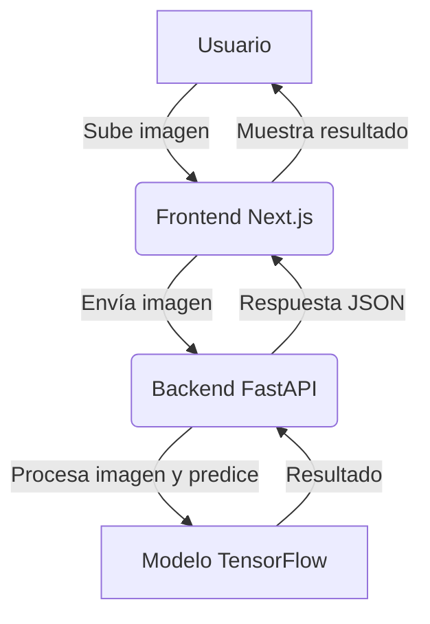

<p align="center"># Monilia App - Backend

  

</p>Backend API para la detección de moniliasis en mazorcas de cacao usando FastAPI y TensorFlow.


<h1 align="center">Monilia Detector - Cacao Disease Detection Platform</h1>## Despliegue en Render


<p align="center">Este proyecto está configurado para desplegarse fácilmente en Render usando **Python 3.13**.

  <b>Detección inteligente de moniliasis en mazorcas de cacao usando IA, FastAPI y Next.js</b>

</p>### Archivos de configuración:

- `runtime.txt`: Especifica Python 3.13.0 (última versión compatible)

<p align="center">- `Procfile`: Comando para iniciar la aplicación

  - `backend/requirements.txt`: Librerías optimizadas para Python 3.13

  

  ### Librerías actualizadas para Python 3.13:

  - **FastAPI 0.115.6**: Versión más reciente

  - **Pillow 11.0.0**: Compatible con Python 3.13

</p>- **TensorFlow 2.18.0**: Última versión estable

- **NumPy 2.1.3**: Compatible con Python 3.13

---- **OpenCV 4.10.0.84**: Versión más reciente


## Tabla de Contenidos### Configuración en Render:

- [Descripción General](#descripción-general)1. Conecta tu repositorio de GitHub

- [Arquitectura y Funcionamiento](#arquitectura-y-funcionamiento)2. Build Command: `pip install -r backend/requirements.txt`

- [Tecnologías Utilizadas](#tecnologías-utilizadas)3. Start Command: `uvicorn backend.main:app --host=0.0.0.0 --port=10000`

- [Instalación y Puesta en Marcha](#instalación-y-puesta-en-marcha)4. Environment: Python 3 (Render detectará automáticamente Python 3.13)

- [Uso de la Aplicación](#uso-de-la-aplicación)

- [Documentación de la API](#documentación-de-la-api)### Endpoints:

- [Despliegue](#despliegue)- `GET /health`: Verificar estado de la API

- [Contribución](#contribución)- `POST /predict`: Realizar predicción de imagen

- [Licencia](#licencia)

### Variables de entorno (opcionales):

---- `PORT`: Puerto del servidor (por defecto 10000)

- `CORS_ORIGINS`: Orígenes permitidos para CORS

## 📝 Descripción General

Monilia Detector es una plataforma web que permite a agricultores y técnicos identificar la presencia de <b>moniliasis</b> en mazorcas de cacao a partir de imágenes, utilizando un modelo de inteligencia artificial entrenado con TensorFlow. El sistema ayuda a combatir una de las enfermedades más devastadoras del cacao, mejorando la productividad y la calidad del cultivo.

---

## 🏗️ Arquitectura y Funcionamiento



- **Frontend (Next.js):** Interfaz moderna para subir imágenes y visualizar resultados.
- **Backend (FastAPI):** API REST que recibe imágenes, las preprocesa y ejecuta la predicción.
- **Modelo IA (TensorFlow):** Red neuronal ResNet101 entrenada para clasificar imágenes de mazorcas.

---

## 🚀 Tecnologías Utilizadas

| Tecnología     | Versión     | Rol principal                |
|---------------|-------------|------------------------------|
| Python        | 3.13        | Backend, IA                  |
<p align="center">
  
</p>

<h1 align="center">Monilia Detector</h1>
<p align="center"><b>Plataforma de Detección de Moniliasis en Cacao</b></p>

<p align="center">
  
  
  
  
  
  
</p>

---

# Bienvenido a Monilia Detector

Monilia Detector es una plataforma web que utiliza inteligencia artificial para detectar la presencia de moniliasis en mazorcas de cacao a partir de imágenes. Ayuda a agricultores y técnicos a combatir una de las enfermedades más devastadoras del cacao.

---

## Tecnologías Principales

<p align="center">
  
  
  
  
  
  
  
</p>

---

## ¿Cómo Funciona?


---

## Estructura del Proyecto

```
monilia-app/
├── backend/           # API FastAPI y modelo IA
├── frontend/          # Next.js + TailwindCSS
├── docs/              # Documentación tipo GitDocify
├── cacao_resnet101_classifier3.keras
├── class_names.json
└── README.md
```

---

## Instalación Rápida

1. Clona el repositorio y entra al proyecto:
   ```bash
   git clone https://github.com/G2Felipe/monilia-app.git
   cd monilia-app
   ```
2. Configura el entorno Python y dependencias:
   ```bash
   python -m venv env
   env\Scripts\activate
   pip install -r requirements.txt
   pip install -r backend/requirements.txt
   ```
3. Instala dependencias del frontend:
   ```bash
   cd frontend
   npm install
   cd ..
   ```
4. Ejecuta backend y frontend en terminales separadas:
   ```bash
   cd backend && python main.py
   # Nueva terminal
   cd frontend && npm run dev
   ```

---

## Contacto y Contribución

¿Ideas, bugs o mejoras? ¡Abre un issue o pull request!

<p align="center">
  
</p>
cd backend
